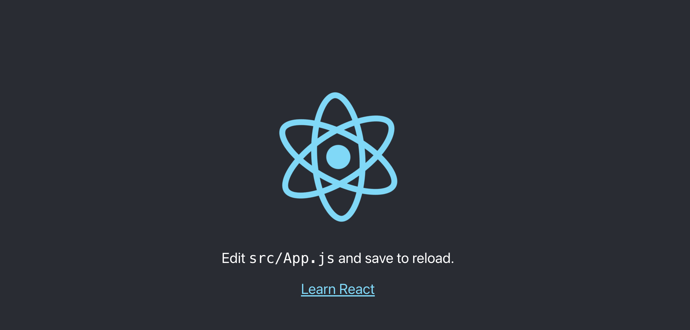

# Build a frontend using React (JavaScript framework)

This project will teach you how to quickly build a frontend for your web app using React which is one of the most popular frameworks for frontend development. Follow the steps and test it afterwards to see that it works properly. 

This was built to communicate with a backend I developed using Django (Python framework) which you can find [here](https://github.com/fblascogarma/backend_starter)

When you finish, you can use this project to customize it for your needs.

If you want to learn React and what you can do with it, check out the references for more resources.

# Steps

1) Create a virtual environment and activate it. If you don't know why this is necessary, check the last section of this file.

2) Before installing React, you need to [install NodeJS](https://nodejs.org/en/download/)

Go to the folder where you want to install your frontend and type

npx create-react-app frontend

You can choose another name for your frontend folder like client.
It will take several minutes and you should see a “Happy hacking!” message when it is done.

 
3) Navigate to your new created folder. In this case, frontend.
To check you are in the correct folder, you can type pwd.
To use routing (recommended), you need to install react-routing-dom by typing

npm i react-router-dom

This is one of the most popular router libraries for React. This is necessary to change the “page” after the user clicks around. 

To start the server, type 

npm start

A tab on Chrome will open showing this which means the server successfully turned on.

 
4) Go to the index.html file in public folder to change the meta data the describes your app. For example, you can change the React logo for your logo in line 5 and 10.

You can add scripts to use CSS frameworks like [Bootstrap](https://getbootstrap.com/) and [FontAwesome](https://fontawesome.com/v4.7/get-started/).

Check the index.html file to see the entire code.

Another option is to install Bootstrap by typing

npm i bootstrap

And adding it to the index.js file.

5) In the src folder, create a folder called components. In that folder you will add all the components your web app is going to use. Components are the building blocks in React. 

I created a Home.js component that will serve as my homepage. Also created a NavBar.js component that will serve as my navigation bar, a Footer.js that will serve as my footer, About.js that will be my page to tell what the app is about, Contact.js that will be the page for users to contact us by sending us a message.

Also created a ScrollToTop.js component so every time a user clicks to go to a new ‘page’, the UI starts from the top. If you don’t do this, it will start from where you left. For example, if you were scrolled at the bottom, it will start the new page at the bottom.

You need to add those to the App.js file by importing them. In that file you will also need to configure the BrowserRouter.

Check those files and copy paste the code if you like and add the components that you might want for your app.

6) You will use useEffect to fetch data from the backend.

APIService.js to handle all API requests to the backend is on the src folder (not on the components folder). Use back ticks (`) when you need to put a dynamic value in the URL to fetch or if you need to dynamically include values in the headers of the request.

UpdateArticle.js is the file that serves like a form where the user can update data or create new data. You use the APIService.js file you created to talk with the backend of your app.

In the GoogleAds.js file you have the UpdateArticle component with the consts you created on UpdateArticle.js to send as a props.

7) Create Login.js file to handle logins of users.

You need to install react-cookie by typing

npm install react-cookie

This is to store the token of the user on a cookie.
Change index.js file to wrap up the router with the cookie handler.

This project lets users navigate the app without having to login, but if they want to go to the Google Ads page, they will be prompted to login to continue. Only login users can add, update, delete articles.

To troubleshoot with tokens saved in cookies, open the dev console in chrome and go to Applications > Cookies. You will see the cookies that you have there and you can eliminate them to test your functionality.

8) You have all the functionalities to communicate with the backend and show data from the backend in GoogleAds.js, UpdateArticle.js, and APIService.js. 

You can now use those as guidelines for your features.

You are all set! Customize it for your web app. Read the next section to have a better understanding of this framework.

## About React's framework

The package.json file in the frontend folder will tell you all the libraries that you have installed.

The public folder contains index.html file that you need to edit the meta data and add scripts to use CSS frameworks like Bootstrap. Also, in this folder you can save the images and logos your app will use.

The src folder has the following files that you will need to edit (you can follow the steps aligned in this project): App.js, index.js, App.css.

Also, you will create the file APIService.js in the src folder to handle all API requests.

In the src folder, you will have a folder called components where you will have all the components your app will use.

## References

1) Video tutorial called [Django & ReactJS Full Stack Course [ Python Backend React Frontend ]](https://www.youtube.com/watch?v=VBqJ0-imSMU)
2) [React documentation](https://reactjs.org/docs/getting-started.html)

## Why do we need to create a virtual environment

The virtual environment is something you create when you start a project. It's always advisable to create a virtual environment for your new project so the libraries you install there don't conflict with your other projects that might demand other versions of the libraries. For example, I am using vaderSentiment version 3.3.2 for this project, but for another project, I might need vaderSentiment version 3.2.5.

To create a virtual environment in Python 3 and using VS Code as your IDE, write this in the terminal:
py -3 -m venv name_of_project
In my case, the name_of_project is demo_gh
Go to the folder that contains the virtual environment folder
And to activate the virtual environment type
name_of_project\Scripts\activate
You will see in parenthesis (name_of_project) before the path if you successfully activated the virtual environment.
If you are using shell, to activate the venv you type source name_of_project/bin/activate